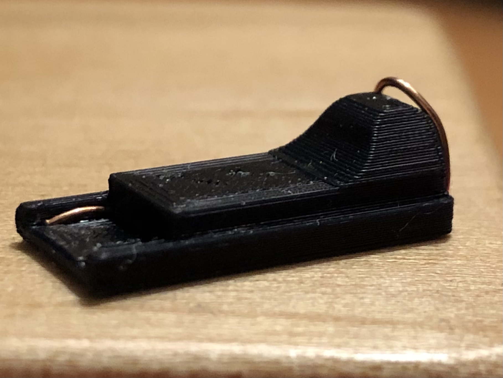

# Common Definitions

These are a list of common definitions that you will see in this guide. This is a good reference point when you're unclear what an acronym means, for example.

## Payload

Some code that we inject into the Switch in order to facilitate running extra software or modified operating systems. In other words, we "inject" payloads (code) to the Switch in order to help us run extra software.

## CFW (**C**ustom **F**irm**w**are)

This refers to the modified software / operating system that runs on the exploited Switch that enables you to do all the cool things outlined in this guide.

### Atmosphère

This is the CFW that you will be using. It's nearly identical to the switch's original firmware (OFW), with some changes, mostly under-the-hood.

[More details about the CFW here](differences.md).

Atmosphère [on Github](https://github.com/Atmosphere-NX/Atmosphere)

## OFW (**O**riginal **F**irm**w**are)

The stock software / operating system that comes with your Switch hardware, before any modification.

## Bootloader

A bootloader is a piece of software (usually injected as a [payload](#payload) whilst in [RCM](#rcm-recovery-mode)) that helps us boot into CFWs, like [Atmosphère](#atmosphere). A bootloader would be one of the first pieces of software that are loaded when the system starts.

### Hekate

This is the bootloader that you will be using. Note only does it include all the necessary software to perform the booting process, but it includes tools for backing up important data, among other things.

[Hekate on Github](https://github.com/CTCaer/hekate)

## RCM (**R**e**c**overy **M**ode)

The Switch's "debug mode". This mode is usually reserved for developers, but we can exploit a vulnerability in this mode that allows us to inject code to the Switch (this is how we can load CFWs.).

[More about running the exploit here](startup-shutdown.md).

### RCM Jig

This is the little plastic device that slides into the right Joycon rail that allows us to access RCM. Basically, the function of this device is to bridge two very specific pins together on that rail.

<figure markdown>
  { width=400 }
  <figcaption>An RCM jig that inserts into the right Joycon rail</figcaption>
</figure>

### AutoRCM

This is a mode that is configured in the Hekate bootloader that forces your switch to go into RCM upon every boot. The advantage of this mode is that you never have to use an RCM jig to inject payloads. However, the disadvantage is that you will not be able to boot into the Switch in any capacity without a payload injector available.

## Homebrew(s)

The singular form (homebrew) typically refers to the process or result of installing a CFW to your Switch (i.e. you "homebrew" your Switch), but **in this guide**, "homebrew" will refer to any custom application you can run as a result of the CFW.

For example, we will refer to applications such as `NX-Shell` as a "homebrew" (or "homebrew application"). 

[More details about Homebrew applications here](homebrews.md).

## RetroArch

The de-facto all-in-one emulator that you will likely be using on the Switch. This application allows you to play emulated titles (mostly from retro consoles) using the Switch's control scheme.

[More about emulation here](emulation.md).

[RetroArch's website](https://www.retroarch.com/)

## sysNAND

This refers to your system (sys) memory (NAND). In other words, we say that any data that is on your sysNAND is on the Switch console itself (i.e. **NOT** on SD card).

## emuNAND

This refers to your emulated (emu) memory (NAND). It's "emulated" because it is a **FULL COPY** of the Switch's sysNAND, **stored on the SD card**. Therefore, when you're "running off emuNAND" (should *always* be the case), any and all data will be stored on the emuNAND (SD card). This allows you to not "taint" your stock configuration whilst making changes. 

