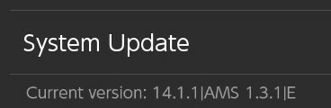

# What's Different?

Compared to the original firmware (OFW), the custom firmware (CFW) has many differences, most of which are under-the-hood.

## Visuals

Visually speaking, the interface will look the same. There are some differences, like the [album applet](#album-applet), described below.

## Applications

Applications, like games, should run the same, as you'd expect. With the CFW you're able to enable overlays to apply cheats, for example. [More about how to do that here](switch-cheats.md).

## Album Applet

You'll notice that when you try to access the Photo Album, you'll get a different interface. This is how you run **applet versions** of homebrew applications, and it replaces the function of the album.

However, the previous functionality is not lost. To access the album as normal, hold the right trigger (:nx-buttons-r:) and select the album icon (using :nx-buttons-a:, or using the touchscreen).

[More details about running homebrews and the album here](homebrews.md).

## Communication With Nintendo

### Blocking Servers

One important change is that while your Switch is in CFW, **ALL communication** with Nintendo will be **BLOCKED**. This means you cannot:

- download app updates
- download system updates
- access the eShop
- play online games

...or really do anything that requires contacting Nintendo's servers.

!!! warning "Why Block Communication?"
    The reason for this is to ensure your Switch does not get *banned*. Nintendo is pretty strict about using CFWs and the other baggage that comes along with it, so blocking all telemetry to Nintendo's servers will ensure this is unlikely to happen.

## Use of emuNAND

When running your Switch CFW, you will be using the emuNAND. The emuNAND is a full copy of your sysNAND (i.e. system storage) stored on a special partition of the SD card, and we run the OS from there. In other words, we've reserved a section of the SD card, so we can run a full copy of your system without touching the original copy on the Switch hardware itself. This has a couple of benefits:

- Changes made to the emuNAND will never touch the sysNAND
    - which means if you screw something up in the emuNAND it won't touch your original installation
- Allows us to safely blank out certain system information in case telemetry is accidentally sent to Nintendo
- Allows you to remove the CFW entirely or restore from a "clean slate" in case something is wrong or broken
- You can boot into either your CFW or OFW, allowing you to play online games in a legitimate manner while minimizing the ban risk
- Generally much safer because everything is on the SD card

!!! info "Note About Saves"
    Because the emuNAND is a **full copy**, things like save games and settings will not transfer to the sysNAND. So if you are switching between sysNAND and emuNAND (so you can play online games legitimately, for example), your save games will have their own copies.

You can check if you're in emuNAND by navigating to `System Settings > System` and look at the small text underneath `System Update`. If there is a trailing `E`, that means you're in emuNAND. If there is an `S` instead, then you're in sysNAND. As a reminder you nearly always want to be in emuNAND. An example is below:

<figure markdown>
  { width=300 }
  <figcaption>The `E` shows us we're in emuNAND mode.</figcaption>
</figure>
