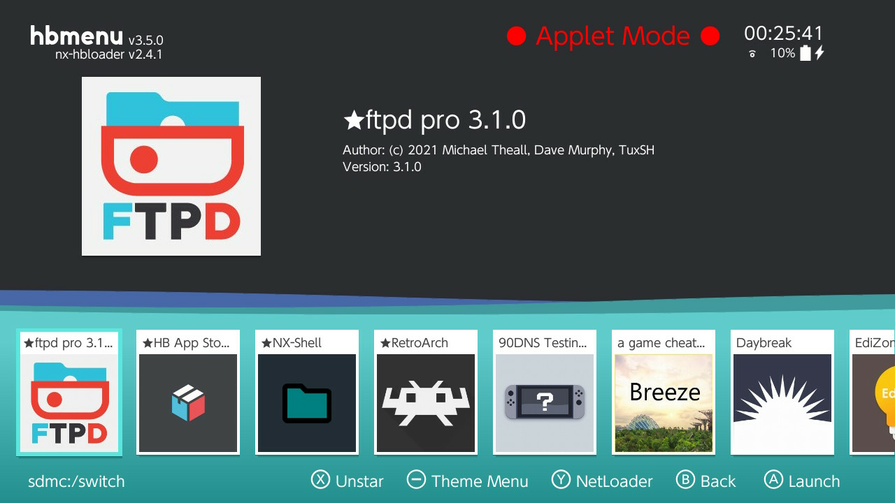
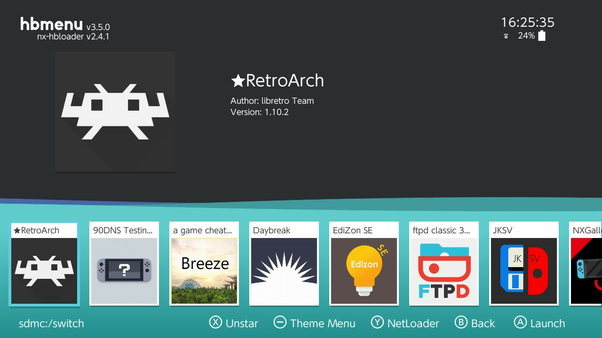
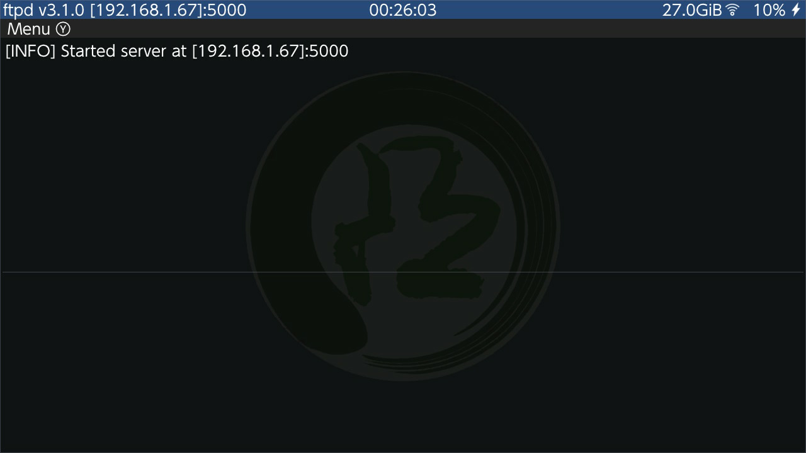

# Homebrew(s)

!!! error "WIP"
    This article is a work in progress!

This section will cover various useful applications that you can run in the CFW. Some homebrews will have their own pages.

## How to Access Homebrews

In Atmosphère, you have two ways to access homebrew applications, depending on your use-case.

### Applet Mode (Through Album)

The first and most-often-used method is through the Album. To access it, simply try to open the album. You will be then faced with an image like this:

<figure markdown>
  { width=600 }
  <figcaption>The homebrew menu. Note the big "Applet Mode" text.</figcaption>
</figure>

From here, you can run any homebrew you see on the list ([see below](#homebrews) for basic). Newly installed ones should appear in this list. You can also favorite frequently-used applications, if you desire.

!!! warning "Applet Mode"
    Homebrews run in this mode have limited memory and lifetime, so don't use this method if your applications requires a lot of computing power (like [RetroArch](#retroarch)).

### Title Mode (Through Game)

Title mode allows the homebrew application to get full access to the Switch's resources. Use this mode if the application you are running requires a lot of resources. In order to access this mode:

1. Make sure you have a title (game) available to load/play.
    - For example, by having a game cartridge in your console, or by having a game installed from the eShop. 
2. Try to launch the game, but **hold the right bumper (:nx-buttons-r:)** while you are doing it.
    - This will completely skip the launch of the game you selected, and will hand over control to the Homebrew menu.
    - You may find it more reliable to keep holding the bumper until you see the Homebrew menu.

If you succeeded, then you should see something like this (importantly, with no "Applet Mode" text at the top right!):

<figure markdown>
  { width=600 }
  <figcaption>The homebrew menu in title mode. Note how there is no "Applet Mode" text.</figcaption>
</figure>

If the game launches instead, go home (:nx-buttons-home:), quit the game, and try again. Make sure you hold the right bumper (:nx-buttons-r:) before attempting to launch again -- and that you are **not letting go** of the button until you see the menu.

## Homebrews

!!! tip "Quitting Some Homebrews"
    Homebrew applications (especially smaller ones) often have no obvious "quit" button. While you can always go to the home screen to quite applications (album applications will quit immediately), you may be able to press/hold plus or minus (:nx-buttons-plus: / :nx-buttons-minus:) to quit the application and return to the Homebrew menu. 

### Homebrew Appstore

### NX-Shell

### FTPd Pro

If you need to transfer single files that are not too large, it may be more convenient to transfer files over the network. You can use a Homebrew called `ftpd` from mtheall and TuxSH.

1. Make sure you are connected to Wi-Fi
2. Go to the Homebrew loader (Album app), and pick `ftpd pro`:
    - You may see two versions of the application, `ftpd pro`, and `ftpd classic`. Both will work fine, but the pro version has a better UI.
    <figure markdown>
      { width=600 }
    </figure>

3. Launch it and take note of the IP address and port it lists at the top:

    <figure markdown>
      { width=600 }
    <figcaption>In this case, the IP is 192.168.1.67 and the port is 5000.</figcaption>
    </figure>

4. Use your favorite FTP client (FileZilla, Cyberduck, etc.) to connect to the FTP server.
    - By default, the server allows **anonymous** connections, meaning that you do not have to specify a user and password combination. You can change this behaviour using the menu accessed via the `y` button (:nx-buttons-y:), while in `ftpd pro`.

5. Transfer the files you need
    - You should see a lot of activity on the Switch when transferring. This is normal.

6. Exit the FTP server from the Switch
    - This can either be done by navigating away (Press Home (:nx-buttons-home:), etc.) or by pressing the Plus or Minus key (:nx-buttons-plus: / :nx-buttons-minus:).

!!! warning "Server Lifetime"
    Note that the server will only stay up as long as you have this applet open. Pressing Home (:nx-buttons-home:) or navigating away by any means **will kill the server**.

### EdiZon

### RetroArch
