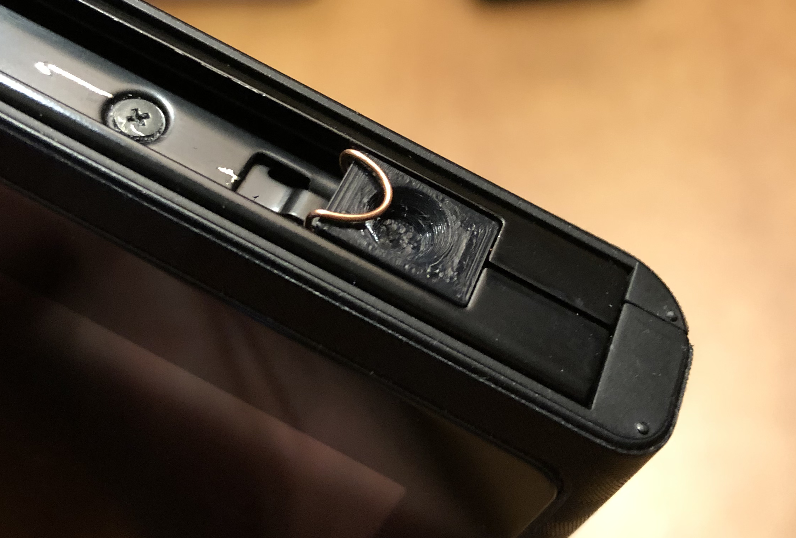
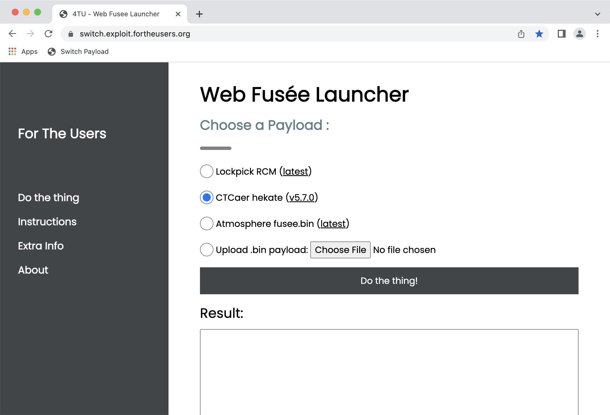

# Startup / Shutdown

!!! error "WIP"
    This article is a work in progress!

## From Cold Boot

If your switch is shut down, out of battery, or is otherwise completely off, you must take extra steps to boot into the CFW, which in most cases requires a computer.

### Entering RCM

Firstly, to inject a payload, we must enter RCM (Recovery Mode).

#### With a Jig (AutoRCM OFF)

If you have AutoRCM off (default behaviour), you must use a jig to enter RCM. The jig looks something like the following:

{ width=49% }
{ width=49% }

Start by removing the **right** Joycon from the console. Then insert the jig into the rail, copper-wire side down and push it all the way (note that the jig pictured is different from the one above):

{ width=49% }
{ width=49% }

Assuming it is seated correctly, from a **POWERED OFF STATE**, hold Volume Up and **tap** the power button. After tapping the home button you can stop holding hte volume button.

If you see the Switch boot up, then the process failed.

If seemingly nothing happened, then it worked. RCM has no visual indication on the console.

!!! info "Trying Again"
    Entering RCM may take a couple of tries. If you failed, shut down the console, reseat the jig, and try again. You should get it eventually.

#### Without a Jig (AutoRCM ON)

If you have AutoRCM on, then no jig is required. Merely booting the switch will place it in RCM. 

## Injecting Payload

To inject the payload, either use your favorite payload injector, or you can use the [Web Fusée Launcher](https://switch.exploit.fortheusers.org/) (only works on Chromium-based browsers):

Connect your Switch in RCM mode, keep the selection as `CTCaer hekate`, and press the "Do the thing!" button. Assuming the switch is connected properly, it should show up in the list as `APX`:

{ width=49% }
{ width=49% }

Once you press `Connect`, it should work. You should see the Hekate logo, and it should either take you to the Switch CFW or land you at the Hekate home screen (depending on your setup).

## Launching CFW

TODO

## Restarting

TODO

## Shutdown

TODO

## Accessing Bootloader

TODO
