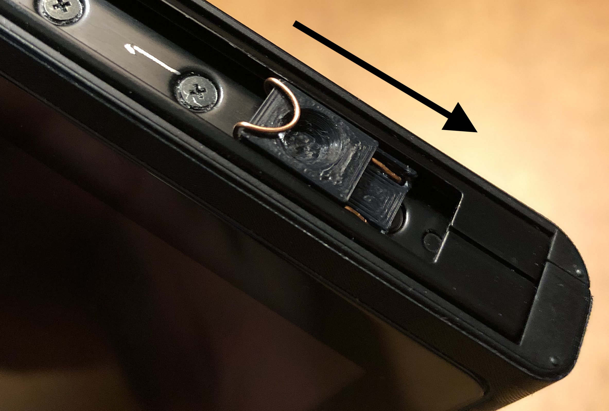

# Startup / Shutdown

## From Cold Boot

If your switch is shut down, out of battery, or is otherwise completely off, you must take extra steps to boot into the CFW, which in most cases requires a computer.

### Entering RCM

Firstly, to inject a payload, we must enter RCM (Recovery Mode).

#### With a Jig (AutoRCM OFF)

If you have AutoRCM off (default behaviour), you must use a jig to enter RCM. The jig looks something like the following:

{ width=49% }
{ width=49% }

Start by removing the **right** Joycon from the console. Then insert the jig into the rail, copper-wire side down and push it all the way (note that the jig pictured is different from the one above):

{ width=49% }
{ width=49% }

Assuming it is seated correctly, from a **POWERED OFF STATE**, hold Volume Up and **tap** the power button. After tapping the home button you can stop holding hte volume button.

If you see the Switch boot up, then the process failed.

If seemingly nothing happened, then it worked. RCM has no visual indication on the console.

!!! info "Trying Again"
    Entering RCM may take a couple of tries. If you failed, shut down the console, reseat the jig, and try again. You should get it eventually.

#### Without a Jig (AutoRCM ON)

If you have AutoRCM on, then no jig is required. Merely booting the switch will place it in RCM. 

## Injecting Payload

To inject the payload, either use your favorite payload injector, or you can use the [Web Fusée Launcher](https://switch.exploit.fortheusers.org/) (only works on Chromium-based browsers):

Connect your Switch in RCM mode, keep the selection as `CTCaer hekate`, and press the "Do the thing!" button. Assuming the switch is connected properly, it should show up in the list as `APX`:

{ width=49% }
{ width=49% }

Once you press `Connect`, it should work. You should see the Hekate logo, and it should either take you to the Switch CFW or land you at the Hekate home screen (depending on your setup).

## Launching CFW

Assuming you've booted into Hekate, in order to get into Atmosphère, just click the big "Launch" button and choose either:

- `Atmosphere FSS0 EmuMMC`; or
- `Atmosphere CFW`

... whichever is applicable. Here's an example:

<figure markdown>
  { width=600 }
  <figcaption>In this case we'd pick the first option.</figcaption>
</figure>
!!! info "Hekate Auto Boot"
    If you have "Auto Boot" (*NOT AutoRCM*) enabled, then this step will happen automatically.

## Restarting

To restart your console, do as normal (hold power button, click "Power Options" and click "Restart").

Depending on whether you have Auto Boot enabled, you either have to do nothing and just wait, or follow the [above section](#launching-cfw) to boot into Atmosphère.

## Accessing Bootloader with Auto Boot

You'll notice that you're seemingly unable to access Hekate by restarting, as it just auto boots you into the CFW. If for whatever reason you need access to Hekate do the following:

1. Reboot the console
2. Wait until the Hekate logo appears
3. Hold the volume down button

This should cancel the auto boot and should place you in the bootloader. Then you can use [the same instructions above](#launching-cfw) to launch into Atmosphère once you're done.

## Shutdown

If you have AutoRCM disabled, shutdown happens normally (hold power button, click "Power Options" and click "Shutdown").

If you have AutoRCM enabled, powering off is a bit more complicated. You have to [boot into Hekate](#accessing-bootloader-with-auto-boot) and use its menu to shut down (bottom right, labelled "Power Off").

!!! warning "Implications"
    Shutting down will prevent you from booting into Hekate without a computer, so make sure you plan for this if you want to shut down your Switch.
