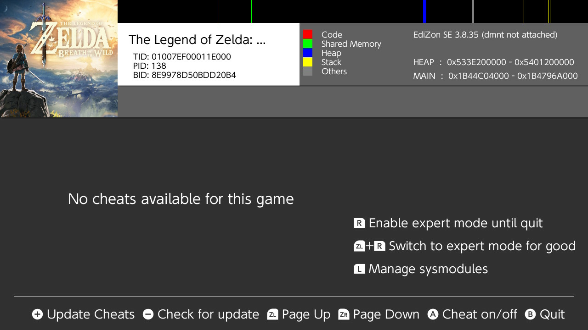

# Cheats (Switch Games)

!!! error "WIP"
    This article is a work in progress!

This will walk you through how to enable cheats from

## Requirements

- `EdiZon SE` for managing cheats.
- `EdiZon Overlay` for applying cheats conveniently, in-game.

## First Steps

1. In order for the following steps to work, you must launch the game you intend to cheat with. 
2. Let the game load up fully before proceeding.
3. Exit to the home menu (using :nx-buttons-home:) and go to the Album app.
4. Launch `EdiZon SE` from this menu. You should see something like the following:
    <figure markdown>
      { width=600 }
    </figure>
5. If you see no cheats, proceed to the [next section to update the database](#updating-the-cheat-database).
6. If you see cheats listed, proceed to the [section on applying cheats](#applying-cheats).

## Updating the Cheat Database

If you see no cheats upon opening EdiZon, and you're confident that it has cheats, EdiZon may need to refresh, or it needs an update to the cheat database

### Refreshing

To refresh EdiZon, simply exit the album applet mode and launch it again after some number of seconds -- all while the game is running in the background. Usually this will refresh the list and actually display the cheats.

Another thing to try is "Update Cheats" by pressing the plus (:nx-buttons-plus:) button.

### Updating Database

If the above step does not work, then EdiZon may need an update to its cheat database. You can do this by pressing the minus (:nx-buttons-minus:) button.

## Applying Cheats

Some games don't have cheats

Some games will crash when enabling cheats

### Applet

### Overlay
