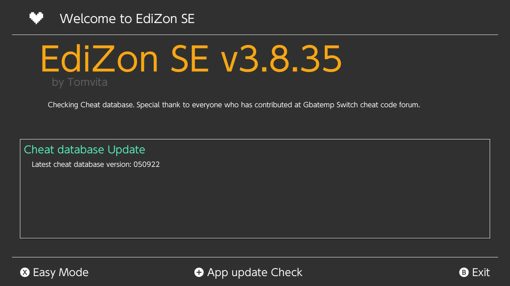

# Cheats (Switch Games)

This will walk you through how to enable cheats for Switch Games, through EdiZon.

## Requirements

- `EdiZon SE` for managing cheats.
- `EdiZon Overlay` for applying cheats conveniently, in-game.

## First Steps

1. In order for the following steps to work, you must launch the game you intend to cheat with. 
2. Let the game load up fully before proceeding.
3. Exit to the home menu (using :nx-buttons-home:) and go to the Album app.
4. Launch `EdiZon SE` from this menu. You should see something like the following:
    <figure markdown>
      { width=600 }
    </figure>
5. If you see no cheats, proceed to the [next section to update the database](#updating-the-cheat-database).
6. If you see cheats listed, proceed to the [section on applying cheats](#applying-cheats).

## Updating the Cheat Database

If you see no cheats upon opening EdiZon, and you're confident that it has cheats, EdiZon may need to refresh, or it needs an update to the cheat database

### Refreshing

To refresh EdiZon, simply exit the album applet mode and launch it again after some number of seconds -- all while the game is running in the background. Usually this will refresh the list and actually display the cheats.

Another thing to try is "Update Cheats" by pressing the plus (:nx-buttons-plus:) button.

### Updating Database

If the above step does not work, then EdiZon may need an update to its cheat database. You can do this by pressing the minus (:nx-buttons-minus:) button. You'll be brought to a screen that looks like this (yours may look different if there is an update available):

<figure markdown>
  { width=600 }
</figure>

Follow the on-screen prompts to perform the update. After it's complete, you can back up from that menu and see if the cheats are present.

!!! warning "Absence of Cheats"
    If you find yourself trying to reload cheats to no avail, the game may not have any cheats available. It's possible a different homebrew has cheats, but this is unlikely.

## Applying Cheats

Applying cheats are as simple as checking the boxes in the EdiZon applet while the game is running, or use the overlay.

!!! info
    Make sure that the game is running, and EdiZon is loaded via applet mode.

### Applet

Assuming you have cheats loaded, the main EdiZon splash screen should look something like this:

<figure markdown>
  { width=600 }
</figure>

Simply just check the cheats that you want to enable and go back to the game.

!!! warning "Applying Too Many Cheats"
    Some games are pretty picky about modifications to the game, so you can expect to encounter some crashes or unexpected behaviour, especially when applying multiple at once.

### Overlay

After you've loaded cheats at least once (i.e. you've encountered a screen [similar to the one above](#applet)), you can now load cheats through the overlay when in-game.

To open the overlay, press left bumper, d-pad down, and click the right stick in ( :nx-buttons-l: + :nx-buttons-joycon-dpad-down: + :nx-buttons-right-stick-click: ). You should see something like this:

<figure markdown>
  { width=600 }
</figure>

This is the Tesla overlay. You can have many applets in this menu, but the one we want to use is EdiZon. Once selected, you should see something like this (assuming your game has cheats):

<figure markdown>
  { width=600 }
</figure>

Simply select the cheats you want to enable from this menu. You may close and return to this menu at any point without having to leave the game.

!!! note
    The same warnings from the previous section apply here, especially the one about enabling too many cheats at once.
